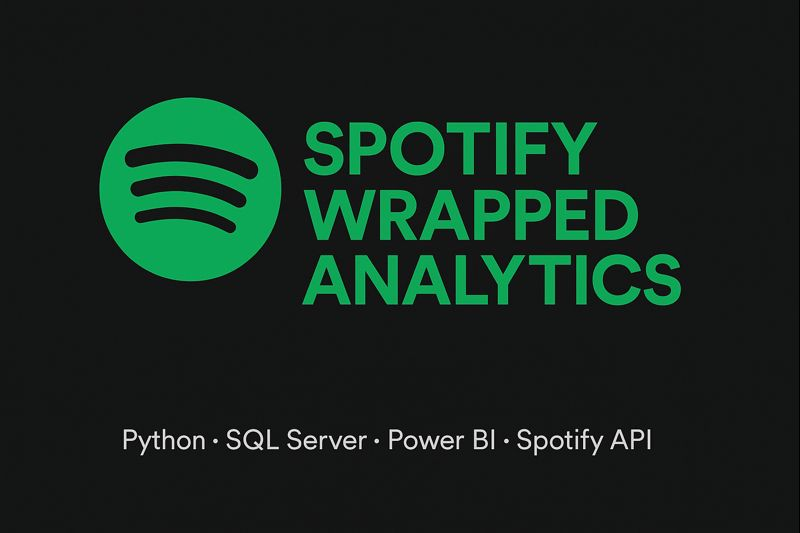
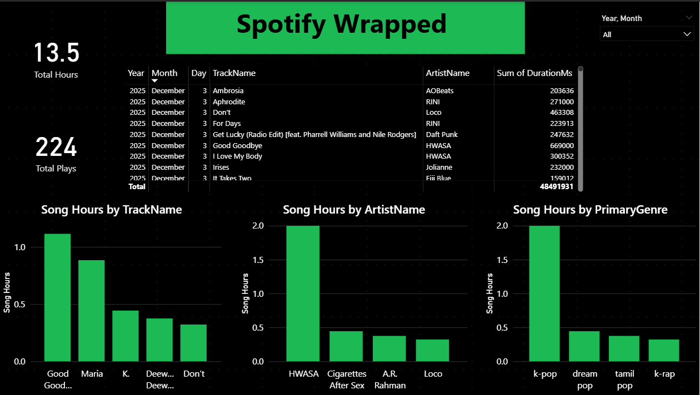
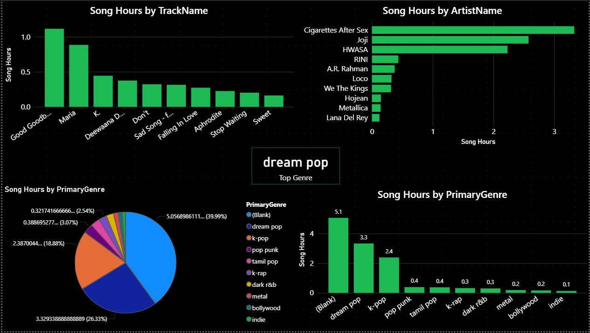
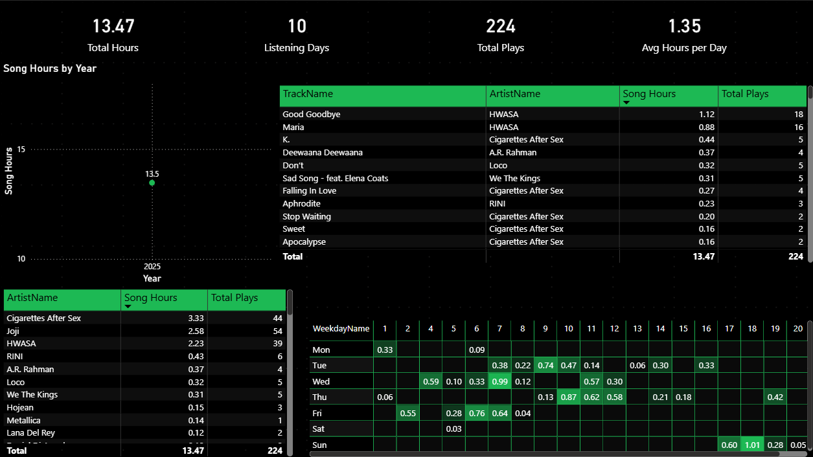
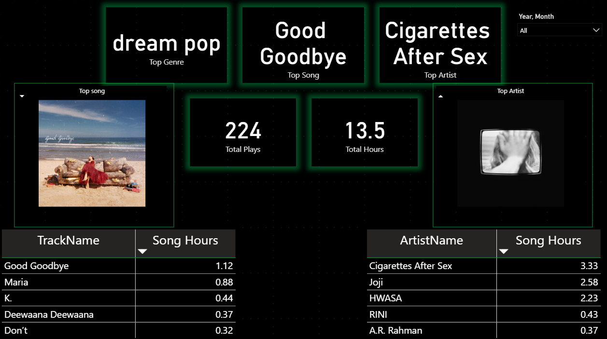

# 🎵 Spotify Wrapped Analytics  
A complete end-to-end data engineering and analytics project replicating **Spotify Wrapped** using:

**Python · Spotify API · SQL Server · Power BI**

This project collects your Spotify listening history, enriches it with metadata and images, stores it in SQL Server, and visualizes insights through a multi-page Power BI dashboard.

---

## 🚀 Features

### ✔ Automated Spotify Data Collection
- Fetches recently played tracks every few minutes  
- Captures track, artist, genre, album, duration, and timestamps  
- Prevents duplicate entries using SQL unique constraints  

### ✔ Image Enrichment Pipeline
- Backfills **album art** and **artist images** via Spotify API  
- Enables Spotify-styled visuals inside Power BI  

### ✔ SQL Data Storage
- Clean relational design  
- Uses `DATETIME2` for accurate UTC timestamps  
- Handles thousands of plays efficiently  

### ✔ Power BI Dashboard (4 Pages)
- **Overview Page** — Summary metrics and trends  
- **Content Insights Page** — Top artists, genres, albums  
- **Listening Habits Page** — Time-of-day & weekly patterns  
- **Wrapped Highlights Page** — Spotify Wrapped-style storytelling  

---

## 🛠️ Tech Stack

| Layer | Technologies |
|------|--------------|
| Data Source | Spotify Web API |
| ETL / Ingestion | Python, Spotipy, OAuth |
| Storage | SQL Server |
| Processing | Python scripts |
| BI & Visualization | Power BI Desktop / Service |
| Configuration | Environment variables (.env) |

---

## 📁 Folder Structure

```text
spotify-wrapped-analytics/
│
├── python/
│   ├── spotify_history_logger.py
│   └── backfill_album_artist_images.py
│
├── sql/
│   └── spotify_listening_history_full.sql
│
├── powerbi/
│   └── SpotifyWrapped.pbix
│
├── assets/
│   ├── overview_page.png
│   ├── content_insights_page.png
│   ├── listening_habits_page.png
│   ├── wrapped_highlights_page.png
│   └── project_banner.png
│
├── .env          # not committed to GitHub
├── .gitignore
└── README.md
```

---

## 🔐 Environment Variables (.env)

Create a `.env` file in the project root:

```env
SPOTIFY_CLIENT_ID=your_spotify_client_id
SPOTIFY_CLIENT_SECRET=your_spotify_client_secret
SPOTIFY_REDIRECT_URI=http://127.0.0.1:8888/callback

SQL_SERVER=localhost\SQLEXPRESS
SQL_DATABASE=DB1
SQL_TRUSTED=true
```

*(This file stays private and is ignored via `.gitignore`.)*

---

## 🐍 Running the Python Scripts

Install dependencies:

```bash
py -m pip install spotipy python-dotenv pyodbc
```

Run the history logger:

```bash
python python/spotify_history_logger.py
```

Run the image backfiller:

```bash
python python/backfill_album_artist_images.py
```

---

## 🗄️ SQL Setup

Run the following script in SQL Server:

```
sql/spotify_listening_history_full.sql
```

This creates the table `SpotifyListeningHistory` with fields for metadata and image URLs.

---

## 📊 Power BI Dashboard Screenshots

### **Overview Page**


### **Content Insights Page**


### **Listening Habits Page**


### **Wrapped Highlights Page**

---

# 🎯 Use Case

Spotify releases **Spotify Wrapped only once a year**, giving no real-time visibility into your listening patterns.  
Users have no way to:

- Analyze long-term listening habits  
- Track top artists, genres, and songs over time  
- Understand behavior patterns (time of day, weekdays vs weekends)  
- Visualize insights in a BI dashboard  
- Access or own their underlying listening data  

This project solves this gap by creating your **own Spotify Wrapped experience**, available **anytime**, powered by Python, SQL Server, and Power BI.

---

# 🧩 Problem Statement

Spotify does not provide:

- A full historical listening activity export  
- An interface for deep analytics  
- Genre or image metadata through the recently played endpoint  
- Tools for behavioral trend analysis  
- A BI-friendly dataset structure  

The core problem:  
**Users do not have long-term access to their own listening history in a form suitable for analysis.**

---

# 🚀 Solution Overview

This project builds an automated analytics system that continuously collects and enriches Spotify listening data:

### ✔ Python + Spotify API (ETL Layer)
- Pulls recently played tracks at short intervals  
- Captures track, artist, album, duration, and timestamps  
- Automatically handles OAuth token refresh  

### ✔ SQL Server (Storage Layer)
- Clean, normalized table structure  
- Unique constraint prevents duplicates  
- Stores enriched data (images, genre) for better BI visuals  

### ✔ Metadata Enrichment
- Fetches album covers & artist images  
- Retrieves primary genre  
- Updates SQL to maintain complete metadata for analytics  

### ✔ Power BI Dashboard (Insights Layer)
- Spotify Wrapped–style storytelling  
- Trend analysis by day, hour, and listening behavior  
- Top artists, genres, songs  
- A visually rich experience enhanced using images  

This pipeline functions as a **year-round Spotify Wrapped**, enabling personal analytics and showcasing full-stack data engineering skills.

---

# ⚔️ Limitations & Challenges (and How They Were Solved)

### 1️⃣ Spotify API returns only the last 50 recently played tracks  
**Solution:**  
A scheduled Python script runs every few minutes, building a complete long-term dataset.

---

### 2️⃣ Duplicate plays returned by the API  
**Solution:**  
SQL constraint on **(TrackId, PlayedAtUtc)** ensures duplicates are never inserted.

---

### 3️⃣ API lacks album/artist images in the history endpoint  
**Solution:**  
A custom backfill script fetches high-quality images using additional Spotify API calls and updates SQL.

---

### 4️⃣ Power BI visuals break with missing images  
**Solution:**  
Backfill ensures all rows contain image URLs → consistent and clean dashboard visuals.

---

### 5️⃣ OAuth token expiration  
**Solution:**  
Spotipy’s `SpotifyOAuth` handles automatic refresh → stable long-running ETL.

---

### 6️⃣ Semi-structured API responses are not BI-ready  
**Solution:**  
Data is modeled into a relational SQL structure:

- TrackId, TrackName  
- ArtistId, ArtistName  
- PrimaryGenre  
- AlbumName  
- AlbumImageUrl, ArtistImageUrl  
- PlayedAtUtc  
- DurationMs  
- Source  

Result: a clean, analytics-ready dataset.

---

## ⭐ Skills Demonstrated

- OAuth authentication with Spotify API  
- ETL pipeline design (Python → SQL Server → Power BI)  
- SQL schema modeling (event-based tables)  
- Data enrichment using API lookups  
- Professional Power BI dashboard design  
- GitHub project structuring & documentation  

---

## 👤 Author

**Deepak**  
GitHub: https://github.com/deepak-2k2
